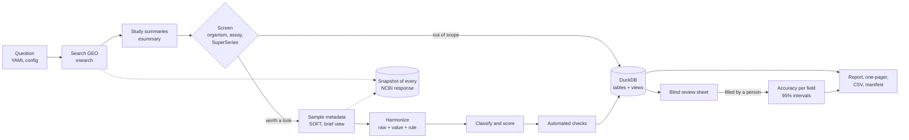

# Dataset Scout

**Find, harmonize and score public gene-expression datasets for one research question, with every number traceable.**

Before a discovery team reuses public data, someone has to answer a slow question: *which of these hundreds of GEO studies can actually support my analysis?* Sample metadata is free text. Age shows up as `3 mo`, `12-week-old`, `P60`, `age (months): 20` or just `aged`. Sex is `M`, `male` or missing. A "microglia" study may turn out to be a cell line.

Dataset Scout automates that first pass for one question at a time and shows its work:

1. searches NCBI GEO and records every response, so a run can be replayed offline;
2. harmonizes sample metadata (age in months, age group, sex, tissue, cell type, strain, genotype, treatment), keeping the raw text and the rule behind every value;
3. scores each study for the question with a transparent, configurable formula;
4. runs automated data checks and loads everything into DuckDB with SQL views;
5. publishes a ranked shortlist, CSV exports, an HTML report and a one-page summary;
6. measures its own accuracy against a **blind review** of a random sample, and publishes who did that review.

The demo question: *which public mouse datasets can support a young-versus-old comparison of microglial gene expression?*

## Results of the demo run

| | |
|---|---|
| GEO series matching the search | 415 |
| In scope (mouse, expression data, not a SuperSeries) | 351 |
| Scored 60 or more (usable) | 129 |
| With young and old baseline samples, at least 3 per group | 48 |
| ...and scored 60 or more | 47 |
| In-scope expression samples harmonized | 27,004 |
| Distinct field names used by submitters | 155 |

Agreement with a blind review of 100 samples, one per study:

| Field | Agreement | 95% interval | Wrong | Missed | Invented |
|---|---|---|---|---|---|
| Age group | 89% | 81&ndash;94% | 4 | 6 | 1 |
| Age in months | 92% | 85&ndash;96% | 2 | 6 | 0 |
| Sex | 98% | 93&ndash;99% | 0 | 2 | 0 |
| Tissue | 90% | 83&ndash;94% | 3 | 7 | 0 |
| Cell type | 90% | 83&ndash;94% | 0 | 9 | 1 |
| Sample type | 82% | 73&ndash;88% | 12 | 6 | 0 |

**Who did that review matters, so it is published with the numbers.** Those 100 samples were labelled from the raw metadata alone, without seeing the program's answers, by Claude Opus 5 (an AI), not by an independent human curator. It is a cross-check between two different methods reading the same text, not ground truth, and it is weaker than it looks: the same model helped write the rules it is checking, so it can repeat their mistakes. The sheet for a human curator is drawn and still empty (`validation/microglia-aging/review_sheet.xlsx`); when it is filled in, `scout validate` replaces these figures and the report names the new reviewer. Every disagreement, with its raw evidence, is in `validation/microglia-aging/disagreements.csv`.

Every number comes from run `microglia-aging-20260917T224701Z` in [`outputs/microglia-aging/run_summary.json`](outputs/microglia-aging/run_summary.json); replaying that run from the recorded responses reproduces them exactly.

Open [`outputs/microglia-aging/report.html`](outputs/microglia-aging/report.html) (download it and open it in a browser) or the [one-page summary](outputs/microglia-aging/one_pager.html).

## How it works



| Stage | What it does | Where |
|---|---|---|
| Extract | NCBI E-utilities and GEO `acc.cgi`, rate-limited, retried, recorded | `http.py`, `ncbi.py` |
| Parse | SOFT text into samples; two-colour reference channels ignored | `soft.py` |
| Harmonize | Rules and a controlled vocabulary (UBERON, CL identifiers) | `harmonize/` |
| Score | Completeness, design fit, data type fit, traceability | `quality.py` |
| Validate | 10 automated checks; blind manual review with Wilson intervals | `checks.py`, `validation.py` |
| Load | Fresh DuckDB file per run, schema plus SQL views | `sql/`, `db.py` |
| Publish | Self-contained HTML report and A4 summary, CSVs, JSON manifest | `report.py`, `templates/` |

Design choices and how this would scale in a client environment are in [docs/ARCHITECTURE.md](docs/ARCHITECTURE.md).

## Quick start

Requires Python 3.10 or newer.

```bash
python -m venv .venv
# Windows:  .venv\Scripts\activate      macOS/Linux:  source .venv/bin/activate
pip install -e ".[dev]"

# Run it live (NCBI asks for a contact e-mail; put it in a .env file, see .env.example)
scout run config/microglia_aging.yaml --max-studies 5    # quick test
scout run config/microglia_aging.yaml                    # full run

# Replay a run offline from the responses it recorded in snapshots/
scout run config/microglia_aging.yaml --mode replay
```

The demo run's recorded responses are not in this repository: they are large and include submitters' contact details.

Other commands:

```bash
scout config config/microglia_aging.yaml          # show resolved settings and the GEO query
scout sql config/microglia_aging.yaml "SELECT gse, score, tier FROM v_usable_studies"
scout review-sheet config/microglia_aging.yaml    # draw 100 samples for blind manual review
scout validate config/microglia_aging.yaml        # compare the filled sheet with the program
scout report config/microglia_aging.yaml          # rebuild the HTML files
pytest                                            # 140 tests, no internet needed
```

With Docker:

```bash
docker build -t dataset-scout .
docker run --rm -v "${PWD}/snapshots:/app/snapshots" dataset-scout run config/microglia_aging.yaml --mode replay
```

A new question is a new YAML file: copy `config/microglia_aging.yaml`, change the query, scope, age thresholds and weights.

## Outputs

| File | Content |
|---|---|
| `report.html` | Screening cascade, shortlist, why studies fell out, metadata completeness, curator inbox, accuracy, checks, method, lineage |
| `one_pager.html` | The same story on one A4 page (print to PDF from the browser) |
| `studies_ranked.csv` | In-scope studies with score, tier, group sizes and flags |
| `samples_harmonized.csv` | One row per sample: raw text, harmonized value and rule for each field |
| `needs_review.csv` | Values the harmonizer refused to guess |
| `data_checks.csv` | Results of the automated checks |
| `run_summary.json` | Every number in the report plus lineage: config fingerprint, snapshot, versions |
| `dataset_scout.duckdb` | All tables and views (rebuilt on each run, not committed) |

SQL views: `v_study_overview`, `v_usable_studies`, `v_age_contrast_studies`, `v_field_completeness`, `v_needs_review`, `v_in_scope_samples`.

## Scoring

Each in-scope study gets five components between 0 and 1; the score is their weighted sum times 100. Weights, thresholds and the target material are in the YAML file.

| Component | Default weight | Definition |
|---|---|---|
| Metadata completeness | 30% | Mean share of samples with age, sex, tissue or cell type, strain or genotype |
| Design fit | 25% | 1 if at least 3 young and 3 old *baseline* samples; 0.5 if both groups exist but are smaller |
| Target material | 25% | Isolated microglia 1.0, cultured microglia 0.5, single-cell data of a tissue that contains them 0.5, whole tissue 0.25, anything else 0 |
| Data type fit | 10% | Bulk RNA-seq 1.0, single-cell 0.8, microarray 0.6 |
| Traceability | 10% | 0.5 for a linked paper, 0.5 for referenced raw data |

The rules are deliberately strict: a short list that holds up is worth more than a long one that does not.

- **Baseline** means untreated and wild type, so "young wild-type versus old transgenic" is not mistaken for an aging design. A Cre driver, a floxed allele or a knockout is not a wild-type mouse, even when the genotype also says "wt". An intervention named anywhere in the metadata (`infection: MHV`, `procedure: stroke`) takes a sample out of the baseline unless the same value names its control (`mock infection`).
- **Replicates are animals, not cells.** Plate-based studies deposit one sample per cell; 300 cells from one mouse are one replicate, not 300.
- **Samples of an organism out of scope are not counted.** In the demo this removed a study whose "old" group was human donors.
- Mouse age groups: young 1.5 to 6 months, old 18 months or more.

## Principles

- **Never guess silently.** A bare `20` is not converted unless the field name gives the unit. Unreadable values go to a curator inbox instead of being filled in. Ages read from titles are flagged as inferred.
- **Everything is traceable.** Raw text, harmonized value and rule sit side by side; each run records its configuration fingerprint and every NCBI response.
- **Measure the tool, not just the data.** Blind review: the reviewer does not see the program's answers, to avoid anchoring, and every accuracy figure is published with the name of whoever produced it.
- **Idempotent runs.** The database is rebuilt from scratch; the same snapshot and configuration give the same tables.

## Limits

- Only metadata is assessed; expression values, batch effects and sequencing quality are not.
- Rule-based harmonization favours precision over coverage.
- Ontology identifiers were entered by hand and should be confirmed with the EBI Ontology Lookup Service.
- GEO's search decides what is found; studies described with other words are missed.

## Related work

[MetaSRA](https://metasra.biostat.wisc.edu/) and [refine.bio](https://www.refine.bio/) already normalize public sample metadata at scale, and [GEOparse](https://github.com/guma44/GEOparse), [GEOquery](https://bioconductor.org/packages/GEOquery/) and [geofetch](https://github.com/pepkit/geofetch) download GEO records. Dataset Scout does not replace them. It is a question-first triage step: transparent scoring for one analysis, automated checks, and a measured error rate.

## About

Built by Facundo Dallo (biologist, FCEyN-UBA) as a portfolio project, with Claude Code as a pair programmer: I set the question, the scientific criteria and what counts as a usable study; the model wrote the code and the harmonization rules under those criteria. The accuracy table above comes from an AI cross-check, not from a human curator, and says so; the blind review by a human is still open. Public data only. MIT licence.
